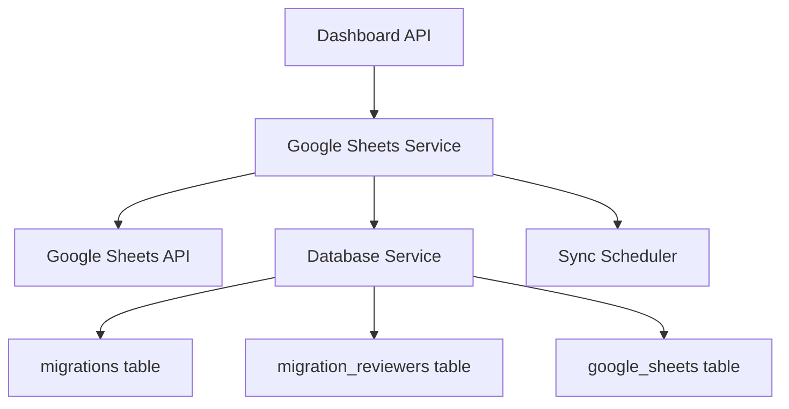

# План интеграции Google Sheets с дашбордом миграций

## Цель

Настроить подключение к Google таблице для синхронизации данных о миграциях. Каждый лист таблицы соответствует отдельной миграции/волне. Менеджеры делают заметки в таблице, система читает данные и записывает результаты миграций.

## Архитектура

### Компоненты системы

### Структура данных

1. **Таблица `google_sheets`** - хранит информацию о подключенных Google таблицах
   - `id` (PK)
   - `spreadsheet_id` - ID Google таблицы
   - `spreadsheet_name` - название таблицы (для отслеживания изменений)
   - `sheet_id` - ID листа (для связи с волной)
   - `sheet_name` - название листа
   - `wave_id` - ID волны миграции (связь с таблицей `waves`)
   - `last_synced_at` - время последней синхронизации
   - `created_at`, `updated_at`

2. **Таблица `migration_reviewers`** - связывает миграции с ревьюерами
   - `id` (PK)
   - `migration_id` - ID из таблицы `migrations` (FK)
   - `person_brizy` - имя человека из Google таблицы
   - `uuid` - UUID проекта из Google таблицы
   - `created_at`, `updated_at`

## Реализация

### 1. Миграции базы данных

**Файл**: `db/migrations/YYYYMMDDHHMMSS_create_google_sheets_tables.php`

Создать две таблицы:
- `google_sheets` - для хранения информации о подключенных таблицах
- `migration_reviewers` - для связи миграций с ревьюерами

### 2. Google Sheets Service

**Файл**: `dashboard/api/services/GoogleSheetsService.php`

Основные методы:
- `authenticate()` - OAuth 2.0 аутентификация
- `getSpreadsheet($spreadsheetId)` - получить информацию о таблице
- `getSheetData($spreadsheetId, $sheetName)` - получить данные листа
- `parseSheetData($data)` - парсинг данных (первая строка - заголовки, извлечение UUID и Person Brizy)
- `syncSheet($spreadsheetId, $sheetName, $waveId)` - синхронизация листа с волной
- `trackSheetName($spreadsheetId)` - отслеживание изменений имени таблицы
- `linkSheetToWave($spreadsheetId, $sheetName, $waveId)` - привязка листа к волне

### 3. Google Sheets Controller

**Файл**: `dashboard/api/controllers/GoogleSheetsController.php`

API endpoints:
- `POST /api/google-sheets/connect` - подключить таблицу
- `GET /api/google-sheets/list` - список подключенных таблиц
- `POST /api/google-sheets/sync/:id` - синхронизировать таблицу
- `POST /api/google-sheets/link-wave` - привязать лист к волне
- `GET /api/google-sheets/sheets/:spreadsheetId` - получить список листов таблицы

### 4. Синхронизация данных

**Файл**: `dashboard/api/services/GoogleSheetsSyncService.php`

Логика синхронизации:
1. Чтение данных из Google таблицы (лист)
2. Парсинг первой строки (заголовки)
3. Извлечение колонок UUID и Person Brizy
4. Поиск соответствующих записей в таблице `migrations` по UUID
5. Создание/обновление записей в `migration_reviewers`
6. Отслеживание изменений имени таблицы

### 5. Real-time синхронизация

**Файл**: `dashboard/api/scripts/google_sheets_sync.php`

Скрипт для периодического опроса (можно запускать через cron):
- Проверка изменений в Google таблицах
- Автоматическая синхронизация данных
- Обновление статусов миграций

### 6. Интеграция с Dashboard

Обновить существующие компоненты:
- `MigrationService.php` - добавить методы для получения информации о ревьюерах
- `WaveService.php` - добавить связь с Google Sheets листами
- Frontend - добавить UI для управления Google Sheets подключениями

## Зависимости

Добавить в `composer.json`:
- `google/apiclient` - официальный Google API клиент для PHP

## Конфигурация

Добавить в `.env`:
- `GOOGLE_CLIENT_ID` - OAuth Client ID
- `GOOGLE_CLIENT_SECRET` - OAuth Client Secret
- `GOOGLE_REDIRECT_URI` - Redirect URI для OAuth
- `GOOGLE_SYNC_INTERVAL` - интервал синхронизации (секунды)

## Безопасность

- Хранение OAuth токенов в зашифрованном виде
- Валидация данных из Google Sheets перед записью в БД
- Проверка прав доступа к Google таблицам
- Логирование всех операций синхронизации

## Тестирование

- Unit тесты для парсинга данных Google Sheets
- Integration тесты для синхронизации
- Тесты на обработку ошибок (недоступная таблица, неверный формат данных)
